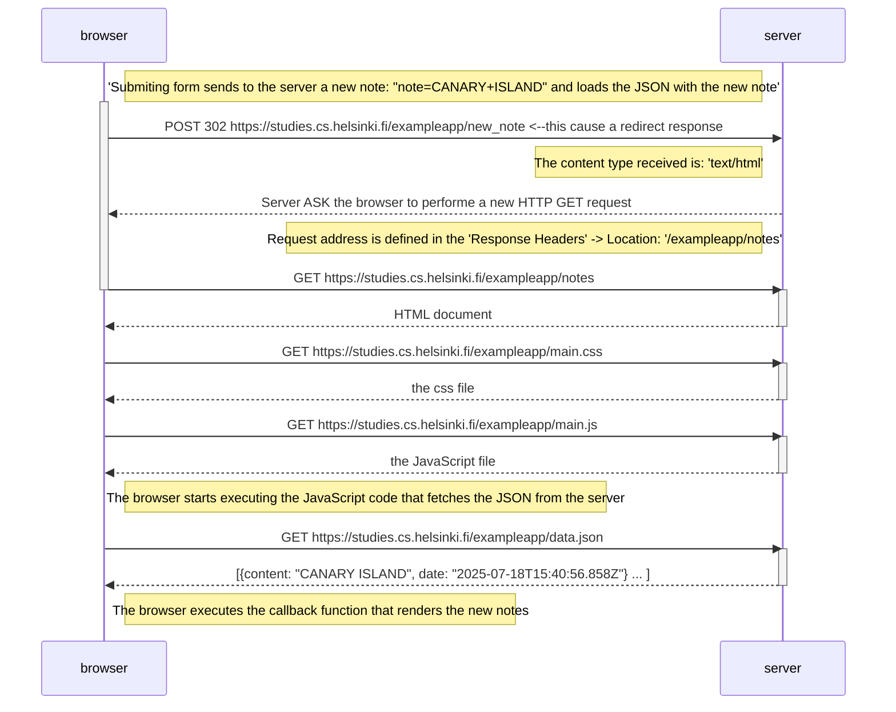

```mermaid
sequenceDiagram
    participant browser
    participant server

    Note right of browser: 'Submiting form sends to the server a new note: "note=CANARY+ISLAND" and loads the JSON with the new note'
    activate browser
    browser->>server: POST 302  https://studies.cs.helsinki.fi/exampleapp/new_note <--this  cause a redirect response

    note left of server: The content type received is: 'text/html'

    server -->> browser: Server ASK the browser to performe a new HTTP GET request
    note left of server: Request address is defined in the 'Response Headers' -> Location: '/exampleapp/notes'

    browser->>server: GET https://studies.cs.helsinki.fi/exampleapp/notes
    deactivate browser

    activate server
    server-->>browser: HTML document
    deactivate server

    browser->>server: GET https://studies.cs.helsinki.fi/exampleapp/main.css

    activate server
    server-->>browser: the css file
    deactivate server

    browser->>server: GET https://studies.cs.helsinki.fi/exampleapp/main.js
    activate server
    server-->>browser: the JavaScript file
    deactivate server

    Note right of browser: The browser starts executing the JavaScript code that fetches the JSON from the server

    browser->>server: GET https://studies.cs.helsinki.fi/exampleapp/data.json
    activate server
    server-->>browser: [{content: "CANARY ISLAND", date: "2025-07-18T15:40:56.858Z"} ... ]
    deactivate server

    Note right of browser: The browser executes the callback function that renders the new notes


```
