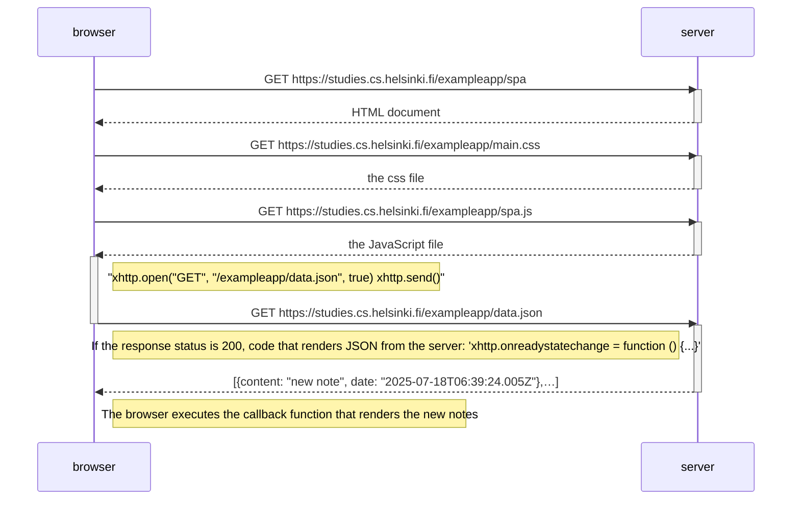

```mermaid
sequenceDiagram
    participant browser
    participant server

    browser->>server: GET https://studies.cs.helsinki.fi/exampleapp/spa

    activate server
    server-->>browser: HTML document
    deactivate server

    browser->>server: GET https://studies.cs.helsinki.fi/exampleapp/main.css

    activate server
    server-->>browser: the css file
    deactivate server

    browser->>server: GET https://studies.cs.helsinki.fi/exampleapp/spa.js

    activate server
    server-->>browser: the JavaScript file
    deactivate server

    activate browser
    Note right of browser: "xhttp.open("GET", "/exampleapp/data.json", true) xhttp.send()"
    browser->>server: GET https://studies.cs.helsinki.fi/exampleapp/data.json
    deactivate browser

    activate server
    Note right of browser: If the response status is 200, code that renders JSON from the server: 'xhttp.onreadystatechange = function () {...}'
    server-->>browser: [{content: "new note", date: "2025-07-18T06:39:24.005Z"},…]
    deactivate server

    Note right of browser: The browser executes the callback function that renders the new notes


```
