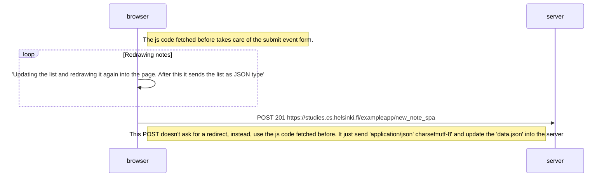

```mermaid
sequenceDiagram
    participant browser
    participant server

    Note right of browser: The js code fetched before takes care of the submit event form.
    loop Redrawing notes
        browser ->> browser: 'Updating the list and redrawing it again into the page. After this it sends the list as JSON type'
    end
    browser->>server: POST 201 https://studies.cs.helsinki.fi/exampleapp/new_note_spa

    Note right of browser: This POST doesn't ask for a redirect, instead, use the js code fetched before. It just send 'application/json' charset=utf-8' and update the 'data.json' into the server


```
